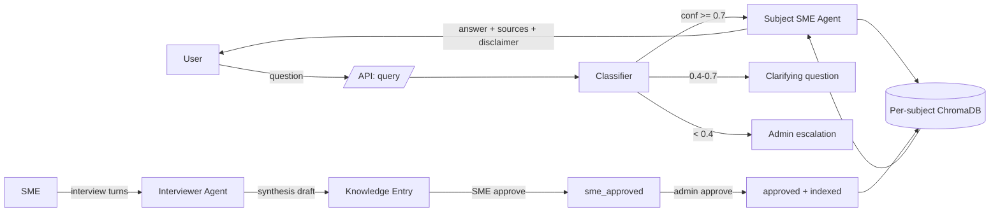
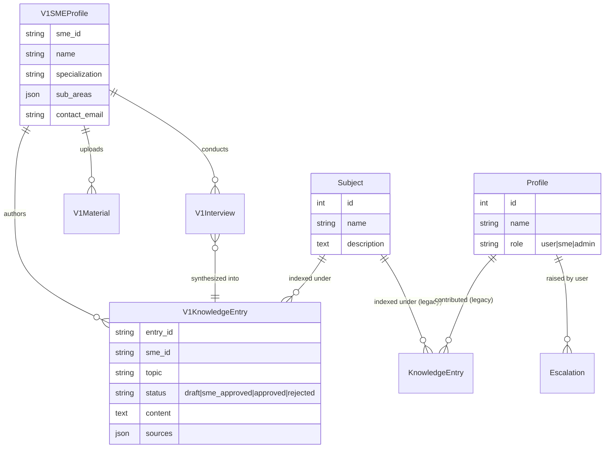

# Project Thoth — Architecture

## System overview

Thoth is an orchestrator-agent system: a thin classifier routes user questions to subject-scoped LLM agents, which retrieve from per-subject vector stores and answer ONLY from approved, SME-authored content. The orchestrator never answers a user question itself, and the answer agents never see knowledge from outside their subject.



## Data model



Two parallel surfaces share the same Subject + ChromaDB layer:
- **Legacy** (`Profile` / `KnowledgeEntry`) — drives the demo frontend.
- **V1** (`V1SMEProfile` / `V1KnowledgeEntry`) — implements the benchmark contract under `/api/v1`.

Both surfaces produce ChromaDB chunks with subject-scoped collection names (`subject_{id}`). The query agent reads from whichever chunks live in the matched subject's collection.

## Tech-stack rationale

| Choice | Why |
|---|---|
| **FastAPI** | Async, Pydantic schemas, free Swagger, clean dependency injection. The benchmark harness expects HTTP+JSON; this is the lowest-friction stack that gives us strict request/response shapes. |
| **SQLite + SQLAlchemy** | Zero-ops for a 2-week PoC. SQLAlchemy lets us swap to Postgres in production without rewriting models. |
| **ChromaDB** | File-backed, embedded, supports per-collection isolation natively. Perfect fit for "one collection per subject" without standing up a vector DB service. Default `all-MiniLM-L6-v2` embeddings are accurate enough for hackathon-scale corpora. |
| **Claude (Anthropic)** | Required by the hackathon. We use the model tier that fits each task — see "Token efficiency" below. |
| **React + Vite + Tailwind** | Designers handed off a Tailwind-token-based design (T-Mobile magenta, white, rounded cards). Vite + Tailwind keeps the single-window UI simple and fast to iterate. |

## Agentic architecture

Three agent roles, all powered by the same model family with different prompts and different scopes.

| Agent | File | Model | Scope |
|---|---|---|---|
| **Classifier (Thoth)** | `services/classifier.py` | Haiku 4.5 | Reads subject names + descriptions; returns the best subject + a confidence + close-call candidates. Cheap and fast — runs on every query. |
| **Subject SME Agent** | `agents/sme_agent.py` | Sonnet 4 | Reads ONLY the matched subject's ChromaDB chunks. System prompt forbids using training data. If chunks don't cover the question, it must refuse. |
| **Interviewer** | `agents/interviewer_v1.py` | Haiku for follow-ups, Sonnet for synthesis | Conducts the SME interview turn-by-turn; synthesizes a draft entry strictly from what the SME said (constrained prompt — no inferences). |

### Confidence routing

```
classifier returns (subject, confidence, candidates)

if confidence >= 0.7 and no close runner-up:
    → SME agent for that subject (answer)
elif confidence >= 0.4 OR multiple candidates within 0.15:
    → clarifying question
else:
    → escalate to admin
```

The clarification → answer transition is stateful: each `session_id` carries the prior turn's `pending_question`, so the user's clarifier is concatenated with the original question on the next classification pass.

## Token efficiency strategy

| Task | Model | Reason |
|---|---|---|
| Classification (every query) | Haiku 4.5 | Tiny prompt, structured output; cost matters because it runs on every turn. |
| Interview follow-up question | Haiku 4.5 | Short, conversational; cost compounds across many turns. |
| Synthesis (interview → entry) | Sonnet 4 | Quality matters — this is the artifact that becomes ground truth. Runs once per entry. |
| Subject SME answer | Sonnet 4 | Retrieved chunks are short; we want the highest-quality grounded answer because hallucination penalties are steep. |
| Closed-book short-circuit | (none) | If KB is empty, refuse without invoking the LLM at all. Saves tokens AND prevents leakage. |

`services/token_tracker.py` accumulates per-call usage and returns it on every endpoint that invokes the model. The smoke suite sums `total_tokens` and reports the run total.

## Capability mapping

The 8 capabilities the harness scores against, and where each lives:

| Capability | Where |
|---|---|
| 1. SME knowledge capture | `agents/interviewer_v1.py` (turns) + `routes/v1/interviews.py` |
| 2. Materials ingestion | `routes/v1/smes.py:upload_material` + `services/file_parser.py` |
| 3. Knowledge synthesis | `agents/interviewer_v1.py:synthesize` + `routes/v1/smes.py:synthesize_knowledge` |
| 4. Two-stage approval | `routes/v1/knowledge.py` (`/approve` then `/admin-approve`) |
| 5. Subject classification | `services/classifier.py` |
| 6. Grounded retrieval | `vector_store.py` per-subject collections + `agents/sme_agent.py` |
| 7. Routing & clarification | `routes/v1/query.py` (confidence thresholds) |
| 8. Closed-book / no-leakage guard | `routes/v1/query.py:_approved_entry_count` short-circuit |

## Knowledge lifecycle

```
[SME interview]                                 (interviewer agent)
        │
        ▼
[Synthesis draft]   status = draft              (Sonnet, no inferences)
        │
        │  POST /knowledge/{id}/approve
        ▼
[SME-approved]      status = sme_approved
        │
        │  POST /knowledge/{id}/admin-approve   (admin gate)
        ▼
[Approved + indexed]  status = approved         (vector_store.add_v1_entry)
        │
        │  POST /knowledge/{id}/reject  (any time)
        ▼
[Rejected]            status = rejected         (vector_store.remove_v1_entry if previously indexed)
```

Indexing happens **only** at admin approval. Drafts and SME-approved entries are not retrievable by the query agent.

## RAG retrieval

- One ChromaDB collection per subject (`subject_{id}`), default `all-MiniLM-L6-v2` embeddings.
- Query path: classifier picks subject → agent embeds the question → top-k (5) chunks from that subject's collection only.
- Chunks include source metadata (`v1_entry_id`, `sme_id`, `topic`, `title`) so the response can build the `sources` array with the SME's name and the entry's topic.
- Retrieval is **scoped at the collection level** — there is no shared embedding space across subjects, so a question routed to "Food Safety" cannot accidentally pull a chunk from "Tax Compliance".

## Guardrails

| Guard | Mechanism |
|---|---|
| **Closed-book refusal** | `_approved_entry_count(db) == 0` → return routing response without LLM call. |
| **No parametric leakage** | SME agent prompt forbids using training data. If the agent output looks like a refusal ("I don't have enough approved knowledge…"), the response layer converts it to a `routing` response so `grounded=true` is never returned for an ungrounded answer. |
| **Mandatory disclaimer** | Every `response_type=answer` carries a non-null `disclaimer` field stating the answer is based on internal SME knowledge. |
| **Mandatory citation** | Every grounded answer ships a non-empty `sources` array — `entry_id`, `sme_name`, `topic`. |
| **Two-stage approval** | A draft never reaches retrieval; an SME-approved entry never reaches retrieval; only admin-approved entries are indexed. |
| **Per-subject isolation** | Vector retrieval is scoped to a single subject collection. No cross-subject contamination is structurally possible. |
| **Token-budget visibility** | Every LLM-invoking response returns `usage`; the smoke suite sums them so cost regressions surface immediately. |

## What's NOT in scope for the PoC

- Real auth (the V1 surface uses a single shared Bearer key).
- Multi-tenancy (everything shares one SQLite + one ChromaDB instance).
- Concurrency hardening for high QPS.
- Audit logs for compliance.

These are addressed in `PRODUCTION_RECOMMENDATIONS.md`.
